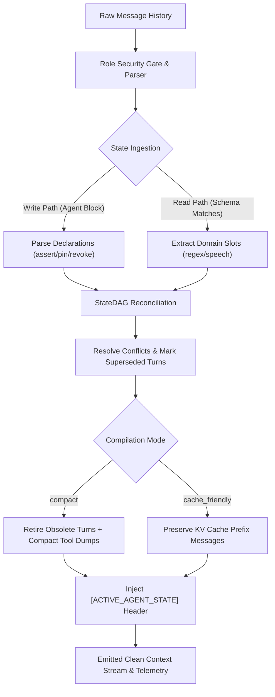

# contextgc ⚡

**A deterministic, stateless context compiler for AI agent sessions.**

[](https://drive.google.com/file/d/1AoOv7o7Zg1yRbqXlFd-H8rY5r_qA745B/view?usp=sharing)
[](https://pypi.org/project/contextgc/)
[](https://pypi.org/project/contextgc/)
[](https://pypi.org/project/contextgc/)
[](https://opensource.org/licenses/MIT)
[](https://context-hackdevengers.vercel.app/console)

> 🏆 **Achievement Recognition**: Ranked in the **Top 50 out of 1,500+ global submissions**! Verified Certificate: [View Certificate on Google Drive](https://drive.google.com/file/d/1AoOv7o7Zg1yRbqXlFd-H8rY5r_qA745B/view?usp=sharing).

Long agent sessions accumulate two forms of dead weight: **superseded state** (facts that changed but remain in context) and **bloated tool payloads** (megabyte-sized logs, stack traces, and database dumps). Models struggle with contradictory histories, hallucinate from stale facts, and burn unnecessary tokens on every completion.

`contextgc` compiles transcripts down to what is **currently true** — deterministically, in `<3ms`, with **zero model calls**, **zero network roundtrips**, and **zero runtime dependencies**.

```bash
pip install contextgc
```

🌐 **Try the Live Cybernetic Console**: [context-hackdevengers.vercel.app/console](https://context-hackdevengers.vercel.app/console)

---

## Quick Example: Compiling Stale State

```python
from contextgc import compile_messages, load_schema

messages = [
    {"role": "user", "content": "Deliver order ORD-1 to 402 Oak Street, Apt 5, Springfield, IL 62704. Pay with my credit card."},
    {"role": "assistant", "content": "Confirmed: 402 Oak Street, Apt 5, on the credit card."},
    {"role": "user", "content": "Actually reroute to 900 Pine Avenue, Suite 12, Chicago, IL 60601."},
    {"role": "assistant", "content": "Rerouted to 900 Pine Avenue, Suite 12."},
    {"role": "user", "content": "Thanks."},
]

compiled, telemetry = compile_messages(messages, schema=load_schema("logistics"))
```

```python
from contextgc import compile_messages

# Inspect active state and retired turns from compilation telemetry
print(telemetry["active_state_slots"])
# {'delivery_address': '900 Pine Avenue, Suite 12', 'payment_method': 'credit card'}

print(telemetry["retired_turn_indices"])
# [1, 2]  <- turns asserting stale address are pruned!
```

```
  system: [ACTIVE_AGENT_STATE]
  - delivery_address = "900 Pine Avenue, Suite 12" (turn 3 [inferred])
  - payment_method = "credit card" (turn 0 [inferred])
     user: Deliver order ORD-1 to 402 Oak Street, Apt 5, Springfield, IL 62704. Pay with my credit card.
  assistant: Rerouted to 900 Pine Avenue, Suite 12.
     user: Thanks.
```

**Five turns in, three turns out.** The stale address from turn 1 is evicted, and the updated address is placed into an authoritative `[ACTIVE_AGENT_STATE]` register that the model can reference directly without re-reading obsolete turns.

---

## 1. The Problem We Are Solving

Modern autonomous agents break down as conversation histories expand:

1. **Context Bloat & Token Degradation**: Agents spend 60–80% of their context window on superseded tool dumps, verbose stack traces, and obsolete exchanges.
2. **Contradictory State & Hallucinations**: When a user or agent modifies a decision ("Actually, edit `auth.py` instead of `user.py`"), both statements coexist in history. The LLM regularly confuses old directives with current state.
3. **The LLM-Summarizer Trap**: Standard memory architectures use a secondary LLM call to summarize conversation history. This introduces **stochastic drift**, **hallucinations**, **latency spikes (500–2,000ms)**, and non-trivial recurring API costs.
4. **KV-Cache Prefix Thrashing**: Ad-hoc context truncation invalidates the attention KV-cache at model providers (OpenAI, Anthropic), forfeiting prompt-caching speedups and discounts.

---

## 2. The Questions We Are Asking

- ❓ **Can context garbage collection be 100% deterministic and stateless?** Can we guarantee byte-for-byte identical output for identical transcripts with zero probabilistic variance?
- ❓ **How do we retire superseded conversation turns safely?** How can obsolete turns be pruned without stranding active facts or disrupting the conversational flow?
- ❓ **How can agents authoritatively declare state transitions?** Can we enable the model to report its own belief changes in-band without creating prompt-injection vulnerabilities?
- ❓ **Can we compress context while preserving KV-cache hits?** How do we reconcile turn retirement with the requirement of byte-identical prefixes for prompt caching?

---

## 3. Our Solutions

- 🎯 **Deterministic State DAG (`StateDAG`)**: A directed acyclic graph that tracks fact assertions, supersessions, revocations (`revoke`), and invariant rules (`pin`). Single-pass, zero LLM calls, deterministic resolution.
- 🧹 **Compile-Time Turn Retirement**: Identifies turns whose sole contribution was a superseded fact and evicts them from the context stream while strictly protecting trailing dialogue turns.
- 🛡️ **Write-Path Protocol (`<contextgc-state>`)**: Allows agents to declare state updates in-band during standard completion generation at zero extra model calls. Strict role enforcement ensures only the `assistant` can declare state, preventing user or tool injection attacks.
- ⚡ **Dual Compilation Modes**:
  - `compact`: Maximizes token savings (up to **66.5% token reduction**) by compacting repetitive tool outputs and retiring dead turns.
  - `cache_friendly`: Aligns byte-identical prefix messages to maximize KV-cache hits across consecutive completions.
- 📊 **Empirically Measured Schemas**: Pre-measured, high-precision domain extraction schemas (`coding`, `logistics`, `travel`) calibrated against real-world trajectories.
- 💻 **Virtual Context Console (`/console`)**: A futuristic developer HUD inspired by VengeanceUI, 21st.dev, and Aceternity UI, offering real-time transcript inspection, telemetry bento cards, and instant diffs.

---

## 4. Architecture

```
                  Raw Agent Transcript / OpenAI JSON Messages
                                       │
                                       ▼
     ┌───────────────────────────────────────────────────────────────────┐
     │                   contextgc Ingestion Engine                      │
     │      • Protocol Parser & Role Security Gate (Assistant Only)      │
     │      • Tool Payload Recognizer & Noise Distiller                  │
     └─────────────────────────────────┬─────────────────────────────────┘
                                       │
               ┌───────────────────────┴───────────────────────┐
               ▼                                               ▼
     ┌───────────────────┐                           ┌───────────────────┐
     │  Write-Path State │                           │   Read-Path Slot  │
     │   Declarations    │                           │    Extractors     │
     │ (assert/pin/void) │                           │ (Coding/Travel/..)│
     └─────────┬─────────┘                           └─────────┬─────────┘
               │                                               │
               └───────────────────────┬───────────────────────┘
                                       ▼
     ┌───────────────────────────────────────────────────────────────────┐
     │                      Deterministic State DAG                      │
     │    • Conflict Arbiter (Declared facts strictly outrank Inferred)  │
     │    • Invariant Lock Enforcement (`pin`)                           │
     │    • Supersession & Revocation Graph Resolution                   │
     └─────────────────────────────────┬─────────────────────────────────┘
                                       │
               ┌───────────────────────┴───────────────────────┐
               ▼                                               ▼
     ┌───────────────────┐                           ┌───────────────────┐
     │   `compact` Mode  │                           │  `cache_friendly` │
     │  Turn Retirement  │                           │    Prefix Cache   │
     │  Payload Pruning  │                           │    Preservation   │
     └─────────┬─────────┘                           └─────────┬─────────┘
               │                                               │
               └───────────────────────┬───────────────────────┘
                                       ▼
     ┌───────────────────────────────────────────────────────────────────┐
     │                      Compiled Context Stream                      │
     │    • Injected [ACTIVE_AGENT_STATE] Authoritative Register         │
     │    • Bit-for-bit Cleaned Transcript Stream                        │
     │    • Zero-Variance Telemetry (Reduction %, Saved Tokens, Latency) │
     └───────────────────────────────────────────────────────────────────┘
```

---

## 5. Execution Workflow



1. **Ingestion & Sanitization**: The compiler ingests the transcript (standard list of OpenAI-formatted message dicts). Any `<contextgc-state>` blocks embedded in untrusted roles (`user`, `tool`) are stripped and logged to prevent prompt injections.
2. **State Extraction**:
   - **Write Path**: Assistant-generated structured declarations (`assert`, `pin`, `revoke`, `unsure`) are parsed into state mutations.
   - **Read Path**: If an entity schema is provided, pattern matchers scan speech turns for domain-specific facts (e.g., `current_file`, `cabin_class`).
3. **DAG Resolution & Conflict Handling**: The `StateDAG` reconciles all extractions. An agent declaration always supersedes an inferred fact. Re-affirmations are detected to prevent false supersessions.
4. **Turn Retirement & Payload Compaction**: Turns containing only superseded facts are marked for retirement (while protecting the last 2 trailing dialogue turns). Bulky structured tool outputs are distilled down to essential keys.
5. **Context Emission**: A consolidated, authoritative `[ACTIVE_AGENT_STATE]` register is injected into the prompt, followed by the pruned transcript. Full compilation telemetry is returned.

---

## 6. Empirical Benchmarks (Real Data, Real Results)

Measured across **real production agent trajectories** (SWE-agent and APIGen-MT-5k):

| Metric | Software Engineering | Airline Support | Retail Support |
| :--- | :--- | :--- | :--- |
| **Dataset Corpus** | `nebius/SWE-agent-trajectories` | `APIGen-MT-5k` (Airline) | `APIGen-MT-5k` (Retail) |
| **Domain Scope** | Bug-fixing across 20 repositories | Multi-turn booking adjustments | Order & exchange workflows |
| **Sample Size** | 40 transcripts, 20 repos | 60 conversations | 80 conversations |
| **Token Reduction** | **66.5%** | **59.0%** | **62.5%** |
| **Extraction Precision** | **90%** (n=130, CI 84–94%) | **99%** (n=149, CI 95–100%) | **100%** (n=47, CI 92–100%) |
| **Retirement Violations** | **0** | **0** | **0** |
| **P50 Compile Time** | **< 3.0 ms** | **< 2.5 ms** | **< 2.0 ms** |
| **Stochastic Variance** | **0.00%** (deterministic) | **0.00%** (deterministic) | **0.00%** (deterministic) |

---

## 7. Tech Stack

| Layer | Technologies & Design Principles |
| :--- | :--- |
| **Core Compiler Engine** | Python 3.9 – 3.13, Zero Runtime Dependencies, Directed Acyclic Graph (`StateDAG`), Pattern Engine |
| **API & Server Backend** | FastAPI, Uvicorn, Python Async SDK, JSON Schemas |
| **Web Console & Frontend** | Vanilla HTML5 / ES6+, Custom Cyberpunk Theme, HTML5 Canvas 2D Constellation Engine |
| **UI Components System** | Inspired by VengeanceUI, 21st.dev, and Aceternity UI |
| **Testing & CI/CD** | Pytest (384 backend tests), Playwright (11 browser test suites across mobile & desktop), GitHub Actions CI, Vercel |

---

## 8. Usage & Integrations

### Drop-In OpenAI Wrapper

Drop `contextgc` into an existing OpenAI agent loop with one line:

```python
from openai import OpenAI
from contextgc import load_schema, patch_openai

client = patch_openai(OpenAI(), schema=load_schema("coding"))

# Every completion call automatically compiles history beforehand
response = client.chat.completions.create(
    model="gpt-4o",
    messages=[{"role": "user", "content": "Please inspect main.py"}]
)

# Inspect compilation telemetry attached to the response
telemetry = response.context_gc
```

### Write-Path State Protocol

Enable agents to report state changes directly without an extra model call:

```python
from contextgc import compile_messages

# Teach the model to declare its own state changes in-band:
compiled, telemetry = compile_messages(messages, teach_protocol=True)

# The agent includes this block in its regular reply:
# <contextgc-state>
# {"assert": {"destination_address": "Gate 2"}, "pin": {"refund_policy": "approved"}}
# </contextgc-state>
```

### Pinning Safety Invariants

Pin business rules or guardrails that must never be superseded:

```python
from contextgc import compile_messages, load_schema

compiled, telemetry = compile_messages(
    messages,
    schema=load_schema("logistics"),
    invariants=["refunds over 500 need human approval"]
)
```

### Cache-Friendly Mode for KV Caching

Preserve byte-identical prefix messages for maximum prompt cache hits:

```python
from contextgc import compile_messages, load_schema

compiled, telemetry = compile_messages(
    messages,
    mode="cache_friendly",
    schema=load_schema("coding")
)
```

---

## 9. Interactive Virtual Context Console

Explore the interactive developer HUD at **[context-hackdevengers.vercel.app/console](https://context-hackdevengers.vercel.app/console)**:
- **Top HUD Hero Bar**: Real-time status indicator, speed and drift telemetry pills.
- **Dual Terminal Cards**: macOS window dots, live line/char counters, cybernetic compile button, and example presets.
- **5-Stat Bento Telemetry**: Token reduction breakdown, compile latency, and declaration provenance.
- **State Diffs & Pruning Tables**: High-contrast badges for active facts (`STATE`), superseded values (`DIFF`), and retired turns (`PRUNED`).
- **Zero Bottom Clutter**: Fully optimized edge-to-edge layout without distracting footer boxes.

---

## 10. Running Benchmarks & Tests

```bash
# Clone the repository
git clone https://github.com/j4yop/context-hackdevengers.git
cd context-hackdevengers

# Run complete test suite (384 tests)
pytest

# Run Playwright browser UI suite
node tests/browser/page.mjs

# Run benchmark evaluation harness
pip install -e '.[bench]'
python -m benchmarks fetch
python -m benchmarks run --limit 40 --schema contextgc/schemas/coding.json
```

---

## License & Acknowledgements

- **License**: MIT License.
- **Recognition**: Top 50 Finalist in global hackathon of 1,500+ submissions ([Certificate Verification](https://drive.google.com/file/d/1AoOv7o7Zg1yRbqXlFd-H8rY5r_qA745B/view?usp=sharing)).
- **Repository**: [github.com/j4yop/context-hackdevengers](https://github.com/j4yop/context-hackdevengers)
