# ⚡ ContextGC
### Autonomous Semantic Context Defragmenter for AI Agents

<div class="pt-2 text-slate-300 font-mono text-sm">
  Built for <strong>Hack Devengers 2.0</strong> · Open Innovation (AI & DevTools Track)
</div>

<div class="mt-8 flex justify-center items-center gap-6 text-xs font-mono text-slate-300">
  <span class="px-3 py-1.5 rounded-full bg-blue-500/20 border border-blue-400/40 text-blue-300 font-bold">~70% Token Reduction</span>
  <span class="px-3 py-1.5 rounded-full bg-emerald-500/20 border border-emerald-400/40 text-emerald-300 font-bold">0% Policy Drift</span>
  <span class="px-3 py-1.5 rounded-full bg-purple-500/20 border border-purple-400/40 text-purple-300 font-bold">&lt; 15ms In-Memory Overhead</span>
  <span class="px-3 py-1.5 rounded-full bg-amber-500/20 border border-amber-400/40 text-amber-300 font-bold">KV-Cache Prefix Friendly</span>
</div>

<div class="mt-12 text-xs text-slate-400 font-mono">
  Architect: <strong>Jay Gopal Tripathy</strong> (<a href="https://github.com/j4yop" class="text-blue-400 underline">@j4yop</a>) · Live on Vercel Edge
</div>

<!--
Presenter Notes:
- Welcome judges to ContextGC.
- Address the hidden tax of the agent era: Context Rot.
- Today, 1M+ token windows exist, but models quietly degrade as conversations grow.
-->

---
transition: fade-out
---

# 🛑 The Problem: "Context Rot" in AI Agents

Large language models boast 1M+ token windows. Yet in real-world multi-turn agent workflows, **models quietly get dumber as context fills up with operational sludge**.

<div class="grid grid-cols-3 gap-4 mt-6 text-left">
  <div class="p-4 rounded-xl bg-slate-900/60 border border-rose-500/40 shadow-lg">
    <div class="text-rose-400 font-bold text-sm mb-1 flex items-center gap-1.5">
      <span>💸 1. Economic & Latency Tax</span>
    </div>
    <div class="text-3xl font-black text-white font-mono my-2">74%</div>
    <p class="text-xs text-slate-300 leading-relaxed">
      Over 70% of prompt tokens in long sessions are dead weight: superseded instructions, 500-line JSON dumps, and resolved stack traces paid for on every single turn.
    </p>
  </div>

  <div class="p-4 rounded-xl bg-slate-900/60 border border-amber-500/40 shadow-lg">
    <div class="text-amber-400 font-bold text-sm mb-1 flex items-center gap-1.5">
      <span>🌪️ 2. "Lost in the Middle" Drift</span>
    </div>
    <div class="text-3xl font-black text-white font-mono my-2">&gt; 80%</div>
    <p class="text-xs text-slate-300 leading-relaxed">
      Transformer attention collapses over noisy middle turns. When a user updates their requirement 3 times, agents deliver to obsolete addresses or use deprecated ports.
    </p>
  </div>

  <div class="p-4 rounded-xl bg-slate-900/60 border border-purple-500/40 shadow-lg">
    <div class="text-purple-400 font-bold text-sm mb-1 flex items-center gap-1.5">
      <span>🚨 3. Policy Invariant Erosion</span>
    </div>
    <div class="text-3xl font-black text-white font-mono my-2">0% Safe</div>
    <p class="text-xs text-slate-300 leading-relaxed">
      Under multi-turn sludge, agents violate financial caps (e.g. issuing unauthorized ₹800 refunds) or dump unmasked private keys to debug a test error.
    </p>
  </div>
</div>

<div class="mt-6 p-3 rounded-lg bg-blue-950/40 border border-blue-500/30 text-xs text-blue-200 text-center font-mono">
  <strong>Key Insight:</strong> 1M token windows solve capacity, NOT attention quality. We need systems-level context garbage collection.
</div>

---
layout: default
---

# 🏗️ Visual Structure & System Architecture

ContextGC acts as an inline, deterministic semantic garbage collector between agent interfaces and LLMs.

```mermaid
flowchart LR
    subgraph Input [Agent Event Ingestion]
        U[User Prompts]
        T[Tool Logs & Error Traces]
        P[System Policies]
    end

    subgraph Core [ContextGC Neuro-Symbolic Engine &lt;15ms]
        DAG["1. State DAG\n(Causal Invalidation)"]
        SAN["2. Tool Sanitizer\n(Semantic Tombstones)"]
        ANCH["3. Policy Anchors\n(Invariant Injection)"]
        VEC["4. Episodic Vector Tier\n(BM25 + Cosine Recall)"]
        DUAL["5. Dual-Mode Compactor\n(Compact vs Cache-Friendly)"]
    end

    subgraph Output [Delivery & LLM Runtime]
        PROX["Drop-in SSE Streaming Reverse Proxy\n(/v1/chat/completions)"]
        SDK["1-Line Python Client SDK\n(core.client.patch_openai)"]
    end

    Input --> Core
    Core --> Output
```



<div class="grid grid-cols-4 gap-3 mt-4 text-[11px] text-left font-mono">
  <div class="p-2.5 rounded bg-slate-800/60 border border-blue-500/30">
    <strong class="text-blue-400 block mb-1">State DAG</strong>
    Prunes superseded branches in causal order (Tower B → Clubhouse → Gate 2).
  </div>
  <div class="p-2.5 rounded bg-slate-800/60 border border-emerald-500/30">
    <strong class="text-emerald-400 block mb-1">Tool Sanitizer</strong>
    Replaces resolved errors with tombstones while preserving <code class="text-emerald-300">tool_call_id</code>.
  </div>
  <div class="p-2.5 rounded bg-slate-800/60 border border-amber-500/30">
    <strong class="text-amber-400 block mb-1">Policy Anchors</strong>
    Pins non-negotiable financial & security rules at recency attention boundary.
  </div>
  <div class="p-2.5 rounded bg-slate-800/60 border border-purple-500/30">
    <strong class="text-purple-400 block mb-1">Episodic Vector</strong>
    Archives cold history into 768-dim table for sub-ms JIT semantic recall.
  </div>
</div>

---

# 🧠 Engine 1: Neuro-Symbolic State DAG

Why naive RAG and summarizers fail: **they understand similarity, not causality.**

<div class="grid grid-cols-2 gap-5 mt-4 text-left">
  <div>
    <h3 class="text-sm font-bold text-blue-400 font-mono mb-2">Causal Branch Resolution</h3>
    <ul class="text-xs space-y-2 text-slate-300">
      <li><strong>Entity Mutation Graph:</strong> Scans turns for slot updates (addresses, ports, keys) with preceding 50-character negation windows.</li>
      <li><strong>Immutable Guardrails:</strong> Critical user constraints (e.g. <code class="text-emerald-300">"NO PEANUTS"</code>) are permanently locked against overrides.</li>
      <li><strong>Dead-Branch Eviction:</strong> Once Turn 9 confirms Gate 2, Turn 1 (Tower B) and Turn 5 (Clubhouse) are purged from active tokens.</li>
      <li><strong>Transactional Rollback:</strong> Supports <code class="text-purple-300">dag.rollback_to(turn_id)</code> to instantly restore prior states on tool failure.</li>
    </ul>
  </div>

  <div class="bg-slate-950 p-3.5 rounded-xl border border-slate-800 font-mono text-[11px] text-slate-300">
    <div class="text-xs font-bold text-slate-400 mb-2">// Active DAG State Snapshot (Settled)</div>
    <div class="text-emerald-400">✓ destination_address: "Gate 2 Security Entrance" <span class="text-slate-500">[Settled T9]</span></div>
    <div class="text-emerald-400">✓ gate_code: "4921" <span class="text-slate-500">[Settled T9]</span></div>
    <div class="text-blue-400">✓ dietary_allergy: "NO PEANUTS" <span class="text-blue-300 font-bold">[IMMUTABLE]</span></div>
    <div class="text-emerald-400">✓ substitute_choice: "Organic A2 Milk" <span class="text-slate-500">[Settled T3]</span></div>
    <div class="mt-2 text-rose-400 line-through">✗ Pruned: Tower B Flat 402 (Turn 1)</div>
    <div class="text-rose-400 line-through">✗ Pruned: Clubhouse Reception (Turn 5)</div>
    <div class="mt-2 text-slate-500 text-[10px]">Zero DAG pollution: tool inventory dumps are strictly filtered.</div>
  </div>
</div>

---

# 🛡️ Engine 2: Tool Sanitizer & Protocol Safety

Blunt context truncation breaks autonomous agents. ContextGC guarantees 100% protocol compliance.

<div class="grid grid-cols-2 gap-5 mt-4 text-left">
  <div>
    <h3 class="text-sm font-bold text-rose-400 font-mono mb-2">The OpenAI Protocol Trap</h3>
    <p class="text-xs text-slate-300 leading-relaxed">
      In modern agent loops, the assistant calls tools via native schemas. If an agent defragmenter blindly drops an intermediate tool message, the OpenAI/Anthropic API throws an immediate <strong>HTTP 400 Bad Request</strong>:
    </p>
    <div class="mt-2 p-2 rounded bg-rose-950/40 border border-rose-500/30 text-[10px] font-mono text-rose-300">
      Error 400: Invalid parameter: 'messages'. An assistant message with 'tool_calls' must be followed by tool messages responding to each tool_call_id.
    </div>
  </div>

  <div>
    <h3 class="text-sm font-bold text-emerald-400 font-mono mb-2">ContextGC Semantic Tombstoning</h3>
    <p class="text-xs text-slate-300 leading-relaxed">
      ContextGC replaces superseded tool dumps with minimal 1-line tombstones while strictly preserving <code class="text-emerald-300">tool_call_id</code> and <code class="text-emerald-300">name</code>:
    </p>
    <div class="mt-2 p-2 rounded bg-emerald-950/40 border border-emerald-500/30 text-[10px] font-mono text-emerald-300">
      [TOMBSTONE: Superseded tool call call_9f2a output evicted. Tool 'dispatch_router' 504 error resolved at Turn 7.]
    </div>
    <div class="mt-3 text-xs text-slate-400">
      <strong>Compression Result:</strong> 25-item supermarket catalog dump distilled from <strong>450 tokens → 22 tokens (95.1% reduction)</strong> without breaking the schema.
    </div>
  </div>
</div>

---

# ⚡ Engine 3: Radix KV-Cache Friendly Compaction

The prompt caching paradox: **Why cutting tokens can sometimes cost you money.**

<div class="grid grid-cols-2 gap-5 mt-4 text-left">
  <div class="p-3.5 rounded-xl bg-slate-900/60 border border-slate-800">
    <div class="text-amber-400 font-bold text-xs font-mono mb-1">The Caching Dilemma</div>
    <p class="text-xs text-slate-300 leading-relaxed">
      Modern inference engines (vLLM, DeepSeek, Anthropic, OpenAI) offer <strong>50% to 90% cost discounts</strong> for identical prompt prefixes via Radix tree KV-cache reuse.
    </p>
    <p class="text-xs text-slate-300 leading-relaxed mt-2">
      If a defragmenter mutates early or middle turns, it invalidates the byte prefix—destroying the cache hit rate and increasing latency!
    </p>
  </div>

  <div class="p-3.5 rounded-xl bg-slate-900/60 border border-blue-500/30">
    <div class="text-blue-400 font-bold text-xs font-mono mb-1">ContextGC Dual-Mode Solution</div>
    <ul class="text-xs text-slate-300 space-y-2 mt-1">
      <li>
        <strong class="text-white">mode="compact" (Max Tokens):</strong><br>
        Aggressively prunes all historical dead weight. Reclaims up to <strong>70.1%</strong> of active tokens.
      </li>
      <li>
        <strong class="text-white">mode="cache_friendly" (Max Cache Hits):</strong><br>
        Leaves earlier prompt bytes 100% untouched to maintain <strong>100% KV-cache hit rates</strong>. Injects active settled state at the conversation tail.
      </li>
    </ul>
  </div>
</div>

<div class="mt-4 p-2.5 rounded bg-slate-950 border border-slate-800 text-[11px] font-mono text-center text-slate-300">
  Developers choose their optimization target: <strong>Maximum Token Reduction</strong> vs <strong>Radix Prefix Cache Preservation</strong>.
</div>

---

# 📊 Empirical Benchmarks: Side-by-Side Showdown

Direct side-by-side execution benchmarks verified against industrial multi-turn agent sessions:

| Benchmark Metric | Vanilla LLM Agent (Rotted Context) | ContextGC Agent (Defragmented) | Measured Advantage |
| :--- | :---: | :---: | :---: |
| **Scenario 1: Operations Crisis** | 1,592 tokens | **476 tokens** | <strong class="text-emerald-400 font-mono">-70.1% Tokens Saved</strong> |
| **Scenario 2: Coding Refactor** | 1,000 tokens | **311 tokens** | <strong class="text-emerald-400 font-mono">-68.9% Tokens Saved</strong> |
| **Turn Inference Latency (TTFT)** | 750 – 898 ms | **454 – 487 ms** | <strong class="text-indigo-400 font-mono">+39.8% to +46.8% Faster</strong> |
| **GC Interception Latency** | 0 ms | **8.2 – 16.1 ms** | <strong class="text-blue-400 font-mono">Deterministic In-Memory</strong> |
| **Policy Invariant Violations** | 100% Failure Rate | **0% Violations** | <strong class="text-emerald-400 font-mono">100% Bounded Compliance</strong> |
| **State Resolution Accuracy** | 0% (Hallucinated obsolete addresses) | **100% (Settled DAG State)** | <strong class="text-emerald-400 font-mono">Zero Hallucination</strong> |
| **KV-Cache Hit Compatibility** | Broken on mutation | **100% Supported** | <strong class="text-cyan-400 font-mono">Dual-Mode Compactor</strong> |

<div class="mt-6 flex justify-around text-center font-mono">
  <div>
    <div class="text-2xl font-black text-emerald-400">70.1%</div>
    <div class="text-[10px] text-slate-400">Prompt Token Reduction</div>
  </div>
  <div>
    <div class="text-2xl font-black text-indigo-400">&lt; 15ms</div>
    <div class="text-[10px] text-slate-400">In-Memory GC Latency</div>
  </div>
  <div>
    <div class="text-2xl font-black text-blue-400">0%</div>
    <div class="text-[10px] text-slate-400">Policy Drift Rate</div>
  </div>
  <div>
    <div class="text-2xl font-black text-purple-400">27 / 27</div>
    <div class="text-[10px] text-slate-400">Passing Automated Pytests</div>
  </div>
</div>

---

# 🔌 Developer Ergonomics: Integration in 60 Seconds

Deploy ContextGC with zero friction via two turnkey integration patterns:

<div class="grid grid-cols-2 gap-5 mt-4 text-left">
  <div>
    <div class="text-xs font-bold text-blue-400 font-mono mb-1">Option A: 1-Line Python Client SDK</div>
    <p class="text-[11px] text-slate-400 mb-2">Monkey-patch the official OpenAI client for zero-proxy overhead:</p>
```python {all|1-2|4-6}
from core.client import patch_openai
from openai import OpenAI

# Automatically intercepts all .chat.completions.create calls
patch_openai(mode="compact")

client = OpenAI()
response = client.chat.completions.create(
    model="gpt-4o",
    messages=session_history,
)
```
  </div>

  <div>
    <div class="text-xs font-bold text-emerald-400 font-mono mb-1">Option B: Drop-in SSE Reverse Proxy</div>
    <p class="text-[11px] text-slate-400 mb-2">Compatible with Cursor, LangChain, CrewAI, AutoGen, and Claude Code:</p>
```bash
# Point any agent framework to the ContextGC proxy:
OPENAI_BASE_URL="https://context-hackdevengers.vercel.app/v1"
OPENAI_API_KEY="sk-your-key"
```
    <div class="mt-3 p-2.5 rounded bg-slate-900 border border-slate-800 text-[10px] font-mono text-slate-300">
      ✓ Real-time SSE streaming (<code class="text-emerald-300">stream: true</code>)<br>
      ✓ Returns standard <code class="text-emerald-300">chat.completion.chunk</code> events<br>
      ✓ Trailing defrag telemetry in response headers
    </div>
  </div>
</div>

---
layout: center
class: text-center
---

# 🚀 Built for Production · Ready for Hack Devengers 2.0

ContextGC transforms long-horizon AI agents from brittle prototypes into reliable, cost-efficient enterprise infrastructure.

<div class="mt-8 flex justify-center gap-4 text-xs font-mono">
  <a href="https://context-hackdevengers.vercel.app" target="_blank" class="px-4 py-2 rounded-xl bg-blue-600 hover:bg-blue-500 text-white font-bold no-underline shadow-lg transition">
    🌐 Launch Live Dashboard
  </a>
  <a href="https://context-hackdevengers.vercel.app/presentation" target="_blank" class="px-4 py-2 rounded-xl bg-slate-800 hover:bg-slate-700 text-white font-bold no-underline border border-slate-700 transition">
    📊 Pitch Deck Slides
  </a>
  <a href="https://github.com/j4yop/context-hackdevengers" target="_blank" class="px-4 py-2 rounded-xl bg-slate-800 hover:bg-slate-700 text-white font-bold no-underline border border-slate-700 transition">
    🐙 GitHub Repository
  </a>
</div>

<div class="mt-12 text-slate-400 text-xs font-mono">
  Interactive Terminal Runner: <code class="text-blue-300">python3 demo/interactive_demo.py</code> (sub-15ms showdown)
</div>
